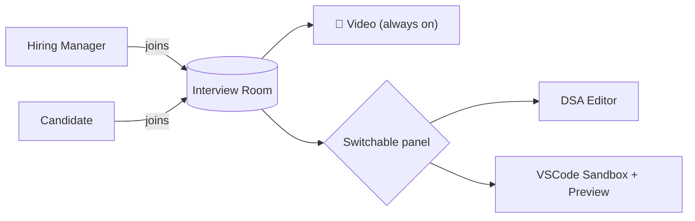
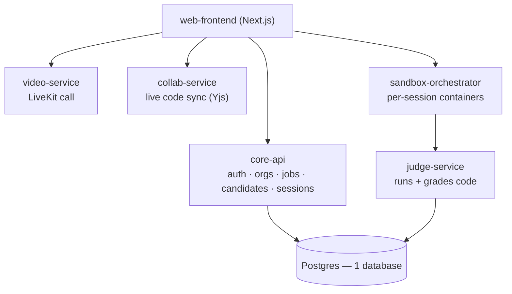
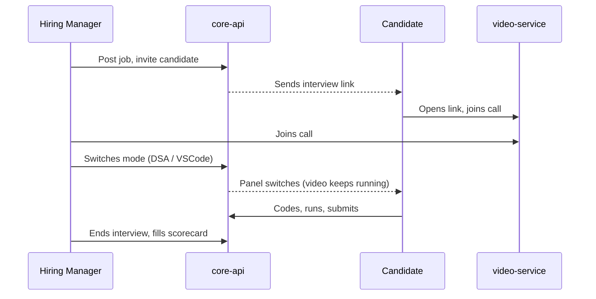

# Interview Platform — MVP Plan

One interview room, three modes, one team building it. This doc is the plan — architecture, features, repos. No implementation here.

> Reference repos are in `Desktop/Projects` and `Desktop/Ideas`. We copy/adapt code from them — none of them are the final codebase.

---

## 1. The idea

- Not three separate tools — **one interview room with switchable modes**.
- Hiring manager + candidate join one video call.
- Video stays live the whole time. The hiring manager switches the shared panel:
  - Video only
  - DSA round (collaborative code editor)
  - VSCode test (real IDE + live preview)
- One link, one room, everything inside it.

---

## 2. Architecture at a glance

- **One Postgres database.** Each service owns its own tables; nobody else writes to them directly.
- **Services split by what they actually need**, not by convenience:
  - `core-api` → plain CRUD
  - `video-service` → media server (very different from CRUD)
  - `sandbox-orchestrator` / `judge-service` → runs untrusted code, needs isolation
  - `collab-service` → long-lived WebSocket connections

---

## 3. Features — have vs. need

### ✅ Resume parsing — already built
- `Interview-Platform-Backend/src/shared/utils/resume-extractor.ts`
- Real parser (not an LLM call): `pdf-parse` + regex section detection — name, email, phone, skills, experience.
- **Action:** lift as-is into `core-api`.

### 🟡 Video call — mostly built, needs wiring
- Backend: `interview-rooms.service.ts` already issues real LiveKit tokens.
- Frontend: `InterviewRoom.tsx` already exists — built, but never connected to a page.
- **Gap:** current flow is solo AI Q&A, not a live 2-person call.
- **Action:** wire the existing component to a real session page; extend tokens for 2 named participants.

### 🟢 VSCode-in-browser + live preview — almost solved
- `open-web-agent/src/lib/docker.ts`: per session, spins up
  - a `code-server` container (the editor)
  - a "runner" container that serves the candidate's dev server as a live preview
- `open-web-agent/src/components/workspace/WorkspaceClient.tsx`: tab UI (VSCode / Preview) — same "switchable panel" idea, already built.
- The one tricky part (iframe-blocking headers) is already solved there.
- **Gap:** it clones a GitHub repo + runs an AI agent — we don't need either.
- **Action:** reuse the two-container pattern + tab UI, swap in a test template instead of a GitHub clone.
- **Note:** this is the *same mechanism* the DSA round needs. One system, two templates — not two systems.

### 🔴 DSA round — editor exists, judge doesn't
- Collaborative editor: `Codeinterview`'s Yjs sync (`yjs-server.js` / `useYjs.js`) — real-time, works.
- Data model: `Codeinterview`'s Prisma schema (`Room`, `Participant`, `Question`, `Schedule`) is a clean base.
- **No real judge exists in any cloned repo:**
  - `Codeinterview` runs code with `new Function()` in-process — not sandboxed, and escapable.
  - `CodingInterviewPlatform` has no server-side execution at all (browser-only).
- **Action:** self-host **Judge0** or **Piston**. Build fresh, run inside the sandbox container from feature above.

### ⬜ Not used
- `CodingInterviewPlatform` — thinner duplicate, reference only
- `vscode` (storezhang fork) — cosmetic wrapper on the same `code-server` image `open-web-agent` already uses correctly
- `realtime-transcribe` — fine tech, just post-MVP (live transcript add-on)

---

## 4. User flow

- **Candidate never provisions anything** — panel changes follow the hiring manager automatically.
- **No candidate signup** — invite link carries a signed session token.

---

## 5. Repos — 7 total

| # | Repo | Purpose |
|---|---|---|
| 1 | `platform` | Local dev bootstrap — one `docker-compose.yml` for everything, secrets, this doc |
| 2 | `core-api` | Auth · orgs · jobs · candidates · resume parsing · session state |
| 3 | `video-service` | LiveKit token issuance + the video call |
| 4 | `sandbox-orchestrator` | Per-session containers — powers both VSCode test and DSA round |
| 5 | `judge-service` | Runs + grades submitted code (Judge0/Piston) |
| 6 | `collab-service` | Live collaborative code editor (Yjs) |
| 7 | `web-frontend` | The actual app — video panel, editor panel, preview panel |

No separate "orchestrator" service — `core-api` owns session state directly at this size.

---

## 6. Data

- **One Postgres database.** Each service owns its tables, others go through its API — no cross-service SQL.
- Starting schema — lift close to `Codeinterview`'s Prisma model:
  - `User`, `Room`, `Participant`, `Question` (`starterCode` / `testCases` as JSON), `Schedule`
  - **Add:** org/company (multi-tenant), scorecards, submission results

---

## 7. Onboarding — no setup calls needed

- One command: `git clone platform` → `./bootstrap.sh` → `docker compose up -d` → `make migrate seed`
- Secrets in a vault (**Infisical**, free tier is fine at this size) — nobody edits a `.env` by hand
- Everything runs in Docker — no local Node/Python/Postgres installs, no "works on my machine"

---

## 8. Build order

1. **`core-api`** — auth + org/job/candidate CRUD + session state → the product spine
2. **`video-service`** — wire up the existing `InterviewRoom.tsx` → demoable 1:1 call fastest
3. **`sandbox-orchestrator`** — port `open-web-agent`'s container pattern → VSCode-in-browser working
4. **`collab-service` + `judge-service`** — port Yjs layer, stand up Judge0/Piston → DSA round working
5. **Wire panel switching in `web-frontend`** → turns 3 features into 1 product
