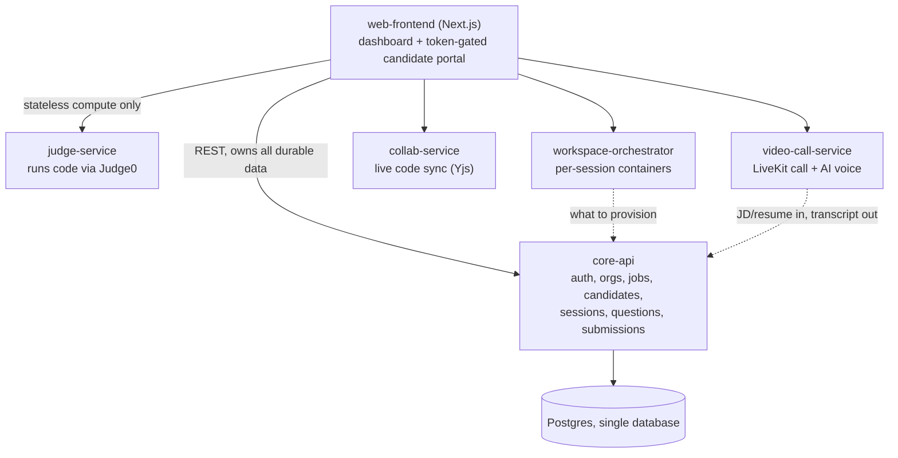
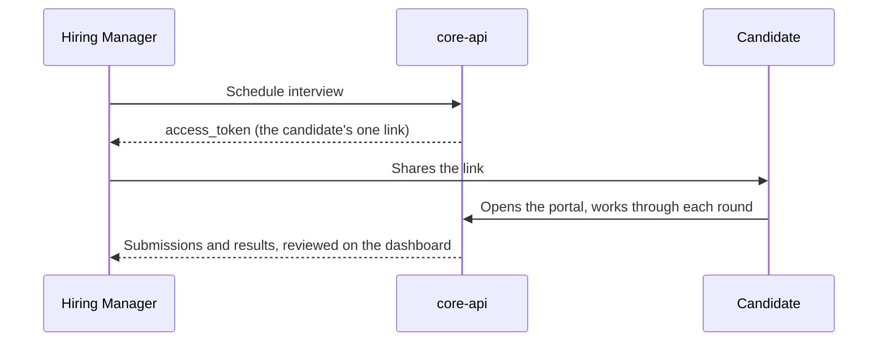

# Interview Platform

## What we're building

A hiring manager posts a job, uploads candidate resumes (parsed automatically for name,
skills, experience, education, links, no AI), and schedules a candidate for interview. That
candidate gets exactly one link, no account, no login, ever. The link opens a token-gated
portal with three rounds:

- **DSA**: two timed coding questions (60 minutes total), graded against real test cases in a
  sandboxed judge, hidden cases never exposed to the candidate.
- **AI Technical**: questions generated from the job description and the candidate's resume,
  asked over a live voice call, responses transcribed and saved.
- **VSCode bug-fix**: a real seeded repo with a couple of planted bugs, a browser-based VS Code
  and a live preview of the running app.

The hiring manager reviews every submission and result from their dashboard afterward. Nothing
here is a demo bundle of three separate tools, it's one product, one link, one review flow.

---

## Setup

### Prerequisites

- `git`
- `docker` and `docker compose`
- [`age`](https://github.com/FiloSottile/age) and [`direnv`](https://direnv.net)

`bootstrap.sh` installs `age` and `direnv` for you via Homebrew if they're missing. Node.js,
Python, and Postgres are not required on your machine, every service runs inside a container.

### Clone and bootstrap

```bash
git clone https://github.com/Umer-2612/platform.git
cd platform
./bootstrap.sh
```

`bootstrap.sh` clones `secrets-vault` (a separate repo holding every service's environment
variables, encrypted) to `~/.secrets-vault`, decrypts it into a shared local cache at
`~/.config/interview-platform/env/` (one passphrase prompt, ask the project owner for it), then
clones every service repo into `services/<name>` and trusts each one's `.envrc`. Safe to re-run,
already-cloned repos are skipped.

### Run

```bash
docker compose up
```

`core-api` is available at `http://localhost:4000`, `web-frontend` at `http://localhost:3000`,
`judge-service` at `http://localhost:4001`. Self-hosted Judge0 (code execution) is expected to
already be running separately on the host, see `judge-service`'s README.

### Testing the API by hand

Open `services/bruno-collection` in the [Bruno](https://www.usebruno.com) desktop app to run
requests against `core-api` as a super admin or a hiring manager. See that repo's README for
the run order.

### Adding a collaborator

Add them to the GitHub repos, and give them the `secrets-vault` passphrase directly (in person
or over a channel you both already trust, never email or a public channel). No dashboard, no
per-project account.

---

## Architecture



**core-api is the only service with a database connection.** Every other service is either
fully stateless (`judge-service`) or holds only ephemeral runtime state (`workspace-orchestrator`'s
running containers, a live call in `video-call-service`), never anything durable. A service that
needs candidate/job/question/submission data gets it through a core-api endpoint; a service
that produces durable data (a submission, a transcript, a bug-fix result) posts it back to a
core-api endpoint. Nothing skips this by connecting to Postgres directly, no matter how
convenient that'd be.

**Services split by what they actually need**, not by convenience:

- `core-api`: plain CRUD, plus anything that needs the data it already owns (JD text, resume,
  question bank) or must stay server-side (grading a dsa submission's hidden test cases by
  calling judge-service itself, generating technical-round questions by calling an LLM). The
  LLM call lives here rather than a separate service because core-api already holds the JD and
  resume needed to build the prompt.
- `video-call-service`: media server plus the AI voice layer (STT/TTS) for the technical round,
  relays text to/from core-api, stores nothing itself.
- `workspace-orchestrator` / `judge-service`: run untrusted code, need isolation, never touch
  Postgres.
- `collab-service`: long-lived WebSocket connections.

### Repos

| Repo | Purpose |
|---|---|
| `platform` | Local dev bootstrap (`bootstrap.sh`), docker-compose, this doc |
| `core-api` | Auth, orgs, jobs, candidates, resume parsing, interview sessions and rounds |
| `web-frontend` | The dashboard and the candidate portal |
| `judge-service` | Proxies code execution to a self-hosted Judge0 instance |
| `video-call-service` | LiveKit call issuance, AI voice layer for the technical round |
| `workspace-orchestrator` | Per-session containers, powers the VSCode bug-fix round |
| `collab-service` | Live collaborative code sync (Yjs) |
| `secrets-vault` | One encrypted file holding every service's environment variables |
| `bruno-collection` | Bruno requests for testing `core-api` by hand, by role |

No separate "orchestrator" service beyond `workspace-orchestrator`'s own narrow job. `core-api`
owns session state directly at this size.

---

## Data flow

One candidate portal (`web-frontend`'s `/interview/:token`, no login, gated only by the
session's `access_token`, see `core-api`'s `API.md`), three rounds, same shape each time:
web-frontend asks core-api what to show, hands any actual compute (code execution, live voice,
a running sandbox) to the service built for it, and reports the result back to core-api.



**DSA:**
```
web-frontend --GET /portal/:token/dsa--> core-api (owns Question, InterviewRound)
  -> assigns 2 questions from the pool the first time it's opened, then keeps them fixed
web-frontend --POST /portal/:token/dsa/start--> core-api (idempotent: starts the 60-minute
  timer the first time, a reload just returns the same started_at, never resets the clock)
web-frontend --POST /execute--> judge-service (stateless) --> Judge0
  (ad hoc "Run" with custom stdin, unsaved, ungraded, browser talks to judge-service directly)
web-frontend --POST /portal/:token/dsa/questions/:id/run-tests--> core-api
  -> core-api --> judge-service --> Judge0, once per test case, server-to-server
     (grading has to happen here: the hidden test cases must never reach the browser)
web-frontend --POST /portal/:token/dsa/questions/:id/submit--> core-api (grades the same
  way, locks that question in, flips the round to completed once both are submitted)
```

**AI Technical:**
```
web-frontend --GET /portal/:token/technical-ai--> core-api
  -> core-api already owns the JD (Job.description) and resume (CandidateProfile),
     calls an LLM (Groq now, swappable to Claude later behind one provider interface)
     to generate questions the first time this round opens, same lazy-assign pattern as DSA
Live in the call: video-call-service's AI voice layer asks each question (TTS) and hears the
  candidate's answer (STT), relaying text to/from core-api as it goes
web-frontend --POST /portal/:token/technical-ai/responses--> core-api (persists the transcript)
```

**VSCode bug-fix:**
```
web-frontend --GET /portal/:token/vscode--> core-api
  -> owns which seeded repo + which 1-2 bugs this round uses (own table, same shape as Question)
workspace-orchestrator asks core-api what to provision, provisions the editor + running-app
  containers (ephemeral, no database of its own), the candidate fixes the bug in-browser
web-frontend --POST /portal/:token/vscode/submit--> core-api (persists the result: tests
  passed, diff, whatever "graded" means for this round)
```
