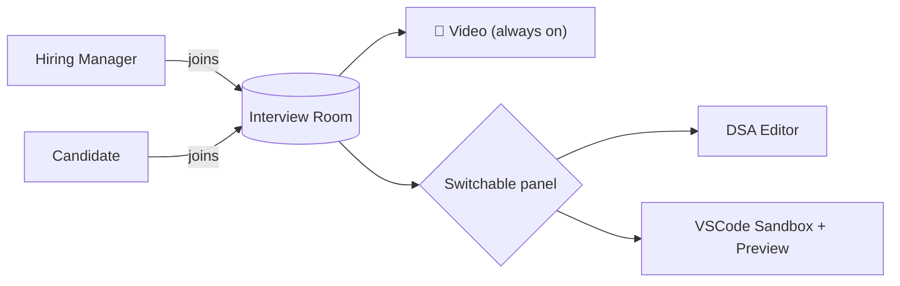
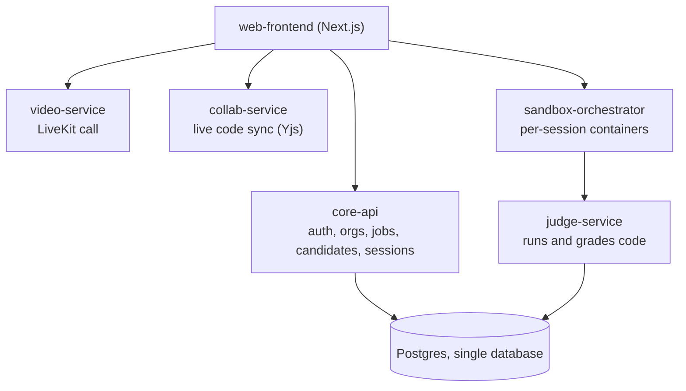
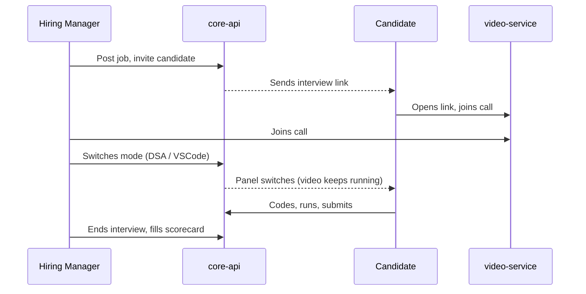

# Interview Platform: MVP Plan

One interview room, three modes, one team building it. This doc is the plan: architecture, features, repos. No implementation here.

> Reference repos are in `Desktop/Projects` and `Desktop/Ideas`. We copy/adapt code from them; none of them are the final codebase.

---

## What's implemented

- `core-api`: authentication and organizations. Login, invitation-based account creation
  (including founding a new organization on acceptance), session lookup, logout.
- `web-frontend`: the pages that use `core-api`'s authentication: sign in, accept an
  invitation, a dashboard showing the logged-in user.
- `video-service`, `sandbox-orchestrator`, `judge-service`, `collab-service`: not implemented.

Database: one Postgres database, hosted on Supabase, shared by every repo in this project.

---

## 1. The idea

- Not three separate tools: **one interview room with switchable modes**.
- Hiring manager and candidate join one video call.
- Video stays live the whole time. The hiring manager switches the shared panel:
  - Video only
  - DSA round (collaborative code editor)
  - VSCode test (real IDE with live preview)
- One link, one room, everything inside it.



---

## 2. Architecture at a glance



- **One Postgres database.** Each service owns its own tables; nobody else writes to them directly.
- **Services split by what they actually need**, not by convenience:
  - `core-api`: plain CRUD
  - `video-service`: media server (very different from CRUD)
  - `sandbox-orchestrator` / `judge-service`: runs untrusted code, needs isolation
  - `collab-service`: long-lived WebSocket connections

---

## 3. Features: have vs. need

### ✅ Resume parsing (already built)
- `Interview-Platform-Backend/src/shared/utils/resume-extractor.ts`
- Real parser, not an LLM call: `pdf-parse` plus regex section detection for name, email, phone, skills, experience.
- **Action:** lift as-is into `core-api`.

### 🟡 Video call (mostly built, needs wiring)
- Backend: `interview-rooms.service.ts` already issues real LiveKit tokens.
- Frontend: `InterviewRoom.tsx` already exists, built but never connected to a page.
- **Gap:** current flow is solo AI Q&A, not a live 2-person call.
- **Action:** wire the existing component to a real session page; extend tokens for 2 named participants.

### 🟢 VSCode-in-browser + live preview (almost solved)
- `open-web-agent/src/lib/docker.ts`: per session, spins up
  - a `code-server` container (the editor)
  - a "runner" container that serves the candidate's dev server as a live preview
- `open-web-agent/src/components/workspace/WorkspaceClient.tsx`: tab UI (VSCode / Preview), same "switchable panel" idea, already built.
- The one tricky part (iframe-blocking headers) is already solved there.
- **Gap:** it clones a GitHub repo and runs an AI agent; we don't need either.
- **Action:** reuse the two-container pattern and the tab UI, swap in a test template instead of a GitHub clone.
- **Note:** this is the same mechanism the DSA round needs. One system, two templates.

### 🔴 DSA round (editor exists, judge doesn't)
- Collaborative editor: `Codeinterview`'s Yjs sync (`yjs-server.js` / `useYjs.js`), real-time, works.
- Data model: `Codeinterview`'s Prisma schema (`Room`, `Participant`, `Question`, `Schedule`) is a clean base.
- **No real judge exists in any cloned repo:**
  - `Codeinterview` runs code with `new Function()` in-process. Not sandboxed, and escapable.
  - `CodingInterviewPlatform` has no server-side execution at all (browser-only).
- **Action:** self-host **Judge0** or **Piston**. Build fresh, run inside the sandbox container from the feature above.

### ⬜ Not used
- `CodingInterviewPlatform`: thinner duplicate, reference only
- `vscode` (storezhang fork): cosmetic wrapper on the same `code-server` image `open-web-agent` already uses correctly
- `realtime-transcribe`: fine tech, just post-MVP (live transcript add-on)

---

## 4. User flow



- **Candidate never provisions anything.** Panel changes follow the hiring manager automatically.
- **No candidate signup.** The invite link carries a signed session token.

---

## 5. Repos (7 total)

| # | Repo | Purpose |
|---|---|---|
| 1 | `platform` | Local dev bootstrap: `bootstrap.sh` clones the other repos and links each to Infisical, this doc |
| 2 | `core-api` | Authentication and organizations |
| 3 | `video-service` | LiveKit token issuance and the video call |
| 4 | `sandbox-orchestrator` | Per-session containers, powers both VSCode test and DSA round |
| 5 | `judge-service` | Runs and grades submitted code (Judge0/Piston) |
| 6 | `collab-service` | Live collaborative code editor (Yjs) |
| 7 | `web-frontend` | The actual app: video panel, editor panel, preview panel |

No separate "orchestrator" service. `core-api` owns session state directly at this size.

---

## 6. Data

- **One Postgres database, hosted on Supabase.** Shared across every repo. Each service owns its
  own tables; others go through its API, not direct SQL.
- `core-api` owns `Company`, `User`, `Invitation` (see its `API.md` for the exact relationships).
- Jobs, candidates, interview sessions, and scorecards are not yet implemented.

---

## 7. Running everything

### Prerequisites

Three things, nothing else:
- `git`
- `docker` and `docker compose`
- the [Infisical CLI](https://infisical.com/docs/cli/overview): `brew install infisical/get-cli/infisical`

Node.js, Python, and Postgres are not required on your machine. Every service runs inside a
container; secrets are fetched from Infisical at startup, never written to a file.

### Setup

```bash
git clone https://github.com/Umer-2612/platform.git
cd platform
./bootstrap.sh
```

`bootstrap.sh` installs the Infisical CLI if it's missing, logs you in (opens a browser), clones
every service repo into `services/<name>`, and links each one to the Infisical project.

### Running

```bash
infisical run --env dev -- docker compose up
```

This builds and starts every service together. `core-api` is available at
`http://localhost:4000`, `web-frontend` at `http://localhost:3000`.

Inviting a new collaborator: add them to the GitHub repos and to the Infisical project. No
credentials get sent to anyone directly.

---

## 8. Build order

1. **`core-api`**: auth plus org/job/candidate CRUD plus session state. The product spine.
2. **`video-service`**: wire up the existing `InterviewRoom.tsx`. Fastest demoable 1:1 call.
3. **`sandbox-orchestrator`**: port `open-web-agent`'s container pattern. Gets VSCode-in-browser working.
4. **`collab-service` + `judge-service`**: port the Yjs layer, stand up Judge0/Piston. Gets the DSA round working.
5. **Wire panel switching in `web-frontend`**. Turns 3 features into 1 product.
