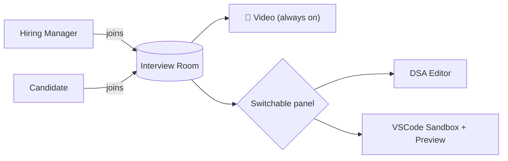
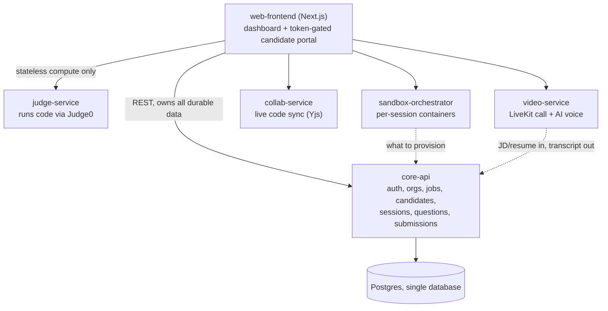
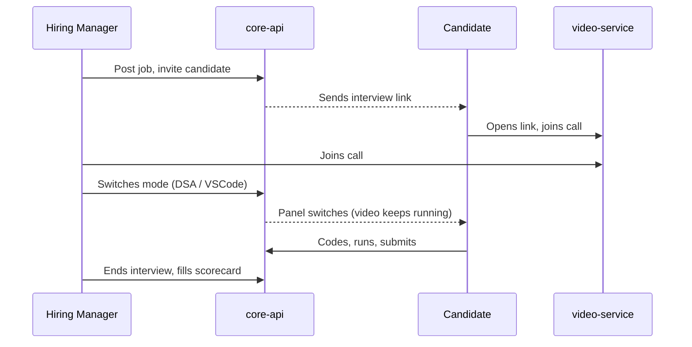

# Interview Platform: MVP Plan

One interview room, three modes, one team building it. This doc is the plan: architecture, features, repos. No implementation here.

> Reference repos are in `Desktop/Projects` and `Desktop/Ideas`. We copy/adapt code from them; none of them are the final codebase.

---

## What's implemented

- `core-api`: authentication and organizations (login, direct account creation with no invite
  step, session lookup, logout); jobs; candidates (bulk PDF resume upload, stored in S3, each
  parsed with no AI for name/email/phone/summary/skills/experience/education/other resume
  sections/hyperlinks); one-time interview scheduling (creates its three rounds, running the
  rounds themselves isn't implemented yet).
- `web-frontend`: sign in, a companies page (super admin), a team page, a jobs list and job
  detail page (resume upload, candidate list, scheduling), and a candidate detail page showing
  the full parsed resume profile with inline resume links.
- `video-service`, `sandbox-orchestrator`, `judge-service`, `collab-service`: not implemented.

Database: one Postgres database, hosted on Supabase, shared by every repo in this project.

---

## 1. The idea

- Not three separate tools: **one interview room with switchable modes**.
- Hiring manager and candidate join one video call.
- Video stays live the whole time. The hiring manager switches the shared panel:
  - Video only
  - DSA round (collaborative code editor)
  - VSCode test (real IDE with live preview)
- One link, one room, everything inside it.



---

## 2. Architecture at a glance



- **core-api is the only service with a database connection.** Every other service is either
  fully stateless (`judge-service`) or holds only ephemeral runtime state (`sandbox-orchestrator`'s
  running containers, a live call in `video-service`), never anything durable. A service that
  needs candidate/job/question/submission data gets it through a core-api endpoint; a service
  that produces durable data (a submission, a transcript, a bug-fix result) posts it back to a
  core-api endpoint. core-api is the only reader and the only writer of Postgres, always.
  Nothing skips this by connecting to Postgres directly, no matter how convenient that'd be.
- **Services split by what they actually need**, not by convenience:
  - `core-api`: plain CRUD, plus anything that needs the data it already owns (JD text,
    resume, question bank), including calling an LLM to generate technical-round questions,
    see "Per-round data flow" below.
  - `video-service`: media server (very different from CRUD) plus the AI voice layer (STT/TTS)
    for the technical round, relays text to/from core-api, stores nothing itself.
  - `sandbox-orchestrator` / `judge-service`: run untrusted code, need isolation, never touch
    Postgres.
  - `collab-service`: long-lived WebSocket connections.

### Per-round data flow

Three interview rounds, one candidate portal (`web-frontend`'s `/interview/:token`, no login,
gated only by the session's `access_token`, see `core-api`'s `API.md`). Same shape each time:
web-frontend asks core-api what to show, hands any actual compute (code execution, live voice,
a running sandbox) to the service built for it, and reports the result back to core-api.

```
DSA (built):
  web-frontend --GET /portal/:token/dsa--> core-api (owns Question, InterviewRound)
    -> assigns a question from the pool the first time it's opened, then keeps it fixed
  web-frontend --POST /execute--> judge-service (stateless) --> Judge0 (sandboxed run)
  web-frontend --POST /portal/:token/dsa/submit--> core-api (persists submission, locks round)

AI Technical (not built yet):
  web-frontend --GET /portal/:token/technical-ai--> core-api
    -> core-api already owns the JD (Job.description) and resume (CandidateProfile),
       calls an LLM (Groq now, swappable to Claude later behind one provider interface)
       to generate questions the first time this round opens, same lazy-assign pattern as DSA
  Live in the call: video-service's AI voice layer asks each question (TTS) and hears the
    candidate's answer (STT), relaying text to/from core-api as it goes
  web-frontend --POST /portal/:token/technical-ai/responses--> core-api (persists the transcript)

VSCode bug-fix (not built yet):
  web-frontend --GET /portal/:token/vscode--> core-api
    -> owns which seeded repo + which 1-2 bugs this round uses (own table, same shape as Question)
  sandbox-orchestrator asks core-api what to provision, provisions the editor + running-app
    containers (ephemeral, no database of its own), the candidate fixes the bug in-browser
  web-frontend --POST /portal/:token/vscode/submit--> core-api (persists the result: tests
    passed, diff, whatever "graded" means for this round)
```

The LLM call for the technical round lives inside `core-api`, not a separate service: core-api
already holds the JD and resume it needs to build the prompt, and a dedicated "AI service"
would just have to fetch that from core-api first anyway. `video-service` and
`sandbox-orchestrator` stay narrow: run the live thing, relay/report back, store nothing.

---

## 3. Features: have vs. need

### ✅ Resume parsing (already built)
- `Interview-Platform-Backend/src/shared/utils/resume-extractor.ts`
- Real parser, not an LLM call: `pdf-parse` plus regex section detection for name, email, phone, skills, experience.
- **Action:** lift as-is into `core-api`.

### 🟡 Video call (mostly built, needs wiring)
- Backend: `interview-rooms.service.ts` already issues real LiveKit tokens.
- Frontend: `InterviewRoom.tsx` already exists, built but never connected to a page.
- **Gap:** current flow is solo AI Q&A, not a live 2-person call.
- **Action:** wire the existing component to a real session page; extend tokens for 2 named participants.

### 🟢 VSCode-in-browser + live preview (almost solved)
- `open-web-agent/src/lib/docker.ts`: per session, spins up
  - a `code-server` container (the editor)
  - a "runner" container that serves the candidate's dev server as a live preview
- `open-web-agent/src/components/workspace/WorkspaceClient.tsx`: tab UI (VSCode / Preview), same "switchable panel" idea, already built.
- The one tricky part (iframe-blocking headers) is already solved there.
- **Gap:** it clones a GitHub repo and runs an AI agent; we don't need either.
- **Action:** reuse the two-container pattern and the tab UI, swap in a test template instead of a GitHub clone.
- **Note:** this is the same mechanism the DSA round needs. One system, two templates.

### 🔴 DSA round (editor exists, judge doesn't)
- Collaborative editor: `Codeinterview`'s Yjs sync (`yjs-server.js` / `useYjs.js`), real-time, works.
- Data model: `Codeinterview`'s Prisma schema (`Room`, `Participant`, `Question`, `Schedule`) is a clean base.
- **No real judge exists in any cloned repo:**
  - `Codeinterview` runs code with `new Function()` in-process. Not sandboxed, and escapable.
  - `CodingInterviewPlatform` has no server-side execution at all (browser-only).
- **Action:** self-host **Judge0** or **Piston**. Build fresh, run inside the sandbox container from the feature above.

### ⬜ Not used
- `CodingInterviewPlatform`: thinner duplicate, reference only
- `vscode` (storezhang fork): cosmetic wrapper on the same `code-server` image `open-web-agent` already uses correctly
- `realtime-transcribe`: fine tech, just post-MVP (live transcript add-on)

---

## 4. User flow



- **Candidate never provisions anything.** Panel changes follow the hiring manager automatically.
- **No candidate signup.** The invite link carries a signed session token.

---

## 5. Repos (9 total)

| # | Repo | Purpose |
|---|---|---|
| 1 | `platform` | Local dev bootstrap: `bootstrap.sh` clones the other repos and the secrets vault, this doc |
| 2 | `core-api` | Authentication and organizations |
| 3 | `video-service` | LiveKit token issuance and the video call |
| 4 | `sandbox-orchestrator` | Per-session containers, powers both VSCode test and DSA round |
| 5 | `judge-service` | Runs and grades submitted code (Judge0/Piston) |
| 6 | `collab-service` | Live collaborative code editor (Yjs) |
| 7 | `web-frontend` | The actual app: video panel, editor panel, preview panel |
| 8 | `secrets-vault` | One encrypted file holding every service's environment variables |
| 9 | `bruno-collection` | Bruno requests for testing `core-api` by hand, by role |

No separate "orchestrator" service. `core-api` owns session state directly at this size.

---

## 6. Data

- **One Postgres database, hosted on Supabase.** Shared across every repo. Each service owns its
  own tables; others go through its API, not direct SQL.
- `core-api` owns `Company`, `User`, `Job`, `Candidate`, `CandidateProfile`, `InterviewSession`,
  `InterviewRound` (see its `API.md` for the exact relationships).
- Scorecards, and everything the video/sandbox/judge/collab services would own, are not yet
  implemented.

---

## 7. Running everything

### Prerequisites

A handful of small tools, no accounts, no signups:
- `git`
- `docker` and `docker compose`
- [`age`](https://github.com/FiloSottile/age) and [`direnv`](https://direnv.net)

`bootstrap.sh` installs `age` and `direnv` for you via Homebrew if they're missing. Node.js,
Python, and Postgres are not required on your machine, every service runs inside a container.

### Setup

```bash
git clone https://github.com/Umer-2612/platform.git
cd platform
./bootstrap.sh
```

`bootstrap.sh` clones `secrets-vault` (a separate public repo holding every service's
environment variables, encrypted) to `~/.secrets-vault`, decrypts it into a shared local cache
at `~/.config/interview-platform/env/` (one passphrase prompt, ask the project owner for it),
then clones every service repo, including `bruno-collection`, into `services/<name>` and trusts
each one's `.envrc`.

### Running

```bash
docker compose up
```

This builds and starts every service together. `core-api` is available at
`http://localhost:4000`, `web-frontend` at `http://localhost:3000`.

### Testing the API by hand

Open `services/bruno-collection` in the [Bruno](https://www.usebruno.com) desktop app to run
requests against `core-api` as a super admin or a hiring manager. See that repo's README for
the run order.

Inviting a new collaborator: add them to the GitHub repos, and give them the `secrets-vault`
passphrase directly (in person or over a channel you both already trust, never email or a
public channel). No dashboard, no per-project account.

---

## 8. Build order

1. **`core-api`**: auth plus org/job/candidate CRUD plus session state. The product spine.
2. **`video-service`**: wire up the existing `InterviewRoom.tsx`. Fastest demoable 1:1 call.
3. **`sandbox-orchestrator`**: port `open-web-agent`'s container pattern. Gets VSCode-in-browser working.
4. **`collab-service` + `judge-service`**: port the Yjs layer, stand up Judge0/Piston. Gets the DSA round working.
5. **Wire panel switching in `web-frontend`**. Turns 3 features into 1 product.
